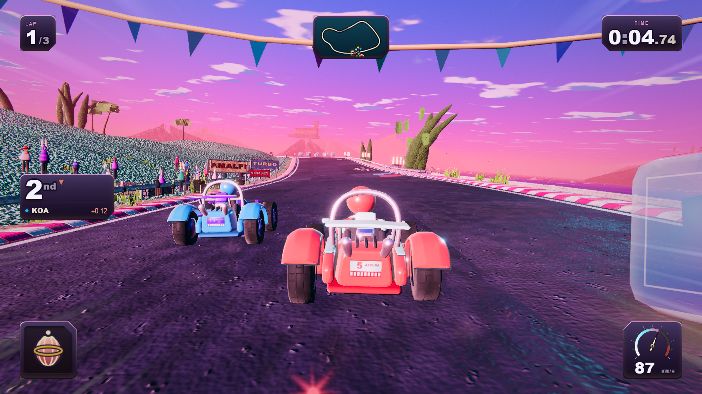
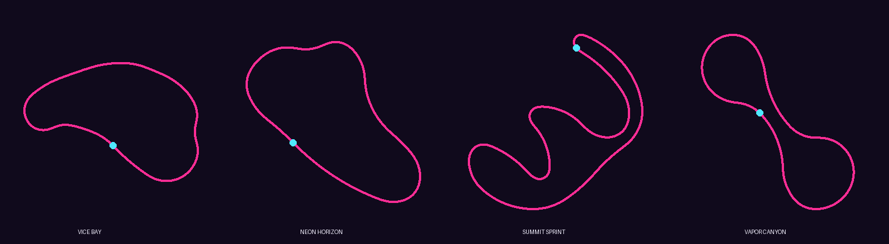
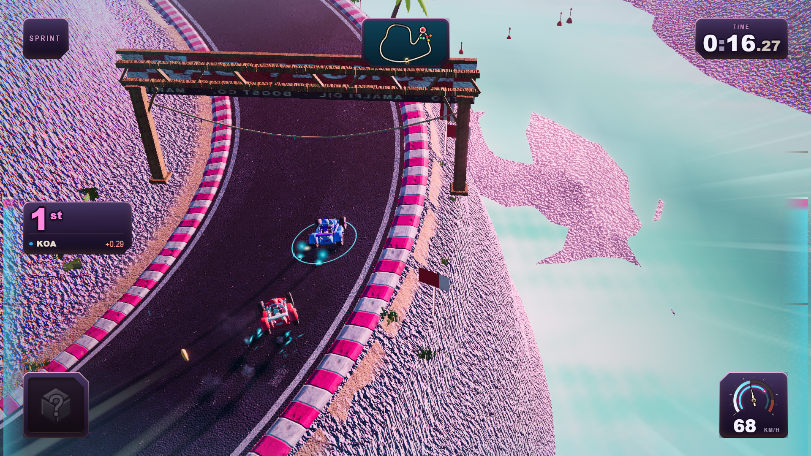

# NEON DRIFT

A synthwave kart racer in the browser. **No art assets.** No Blender, no Unity,
no textures, no models, no fonts, no audio files — every mesh, texture, sound
and note is generated in code at load time.



*Every pixel above is generated at runtime: the sky, the karts, the kerbs, the
sea, the crowd. There is not a single image file in this repository's build.*

## The game

Eight drivers — Nova, Jett, Pixel, Mirage, Vapor, Akira, Frost and Blitz —
race under a permanent neon dusk: indigo overhead falling to a hot pink
horizon, magenta kerbs against ice cyan, teal water, and a chase camera
pointed straight down the sun's collar.

Four events:

| Event | Format | Character |
|---|---|---|
| **Vice Bay Circuit** | 3 laps · 1.6 km | Harbour boulevard, village esses on cobbles, a cliff-ledge traverse, a tunnel, a beach descent and a 20° banked 180 |
| **Neon Horizon GP** | 3 laps · 1.4 km | Open-sky flow: shore straight at sea level, a ridge climb, a high banked carousel over the water, an off-camber chicane |
| **Summit Sprint** | Sprint · 2.2 km | One flying run over the mountain — hairpin switchbacks, a tunnel bored through the summit at 54 m, then a plunge back to a seafront drag |
| **Vapor Canyon** | 3 laps · 1.75 km | Over, under and along the gorge: a descending tunnel dive, a river flat-out, a banked carousel cut into the wall, and a bridge back across the canyon |





Drift to charge mini-turbos (three tiers: cyan, hot pink, violet), grab item
boxes, ride the boost pads. Keyboard, gamepad and touch are all first-class;
on a phone, add it to your home screen and it runs fullscreen in landscape.

## Running it

```bash
npm ci
npm run dev        # dev server on :5173
npm run build      # production build -> dist/
npm run preview    # serve the production build
```

Track select is in-game (title → circuit → racer), or force one with
`?track=sunset-bay | neon-horizon | summit-sprint | vapor-canyon`.

Publishing to VIVERSE: see [PUBLISH-VIVERSE.md](PUBLISH-VIVERSE.md).

## Verification

The repo ships its own gates (see `tools/`):

- `node tools/autoplay.mjs [--track id]` — plays a full race with all eight
  karts on a fixed-step clock and asserts on outcomes: everyone finishes,
  lap accounting is coherent every frame, checkpoints resist shortcuts,
  every item fires/connects/expires, zero console errors.
- `node tools/shot.mjs --quality low [--track id]` — headless captures of
  scripted vantage points. (Use `--quality low` for capture: the high-tier
  post-processing blows out under some headless GL stacks.)

## Lineage

Neon Drift is a fork of [**Kart Royale**](https://github.com/ryancampbell/kart-royale)
by [Ryan Campbell](https://www.ryancampbell.com/kart-royale) (MIT), which was
built by Claude Opus 5 from a single prompt and improved over nine orchestrated
multi-agent rounds using Matt Shumer's
[Gauntlet Loop](https://somethingbig.ai/gauntlet-loop) technique. The
engineering — the procedural pipeline, the physics, the AI, the test
harnesses, and the essay-length comments throughout the source — is his
project's. His original README, including the honest self-scoring and the
post-mortem of what went wrong, is preserved at
[docs/UPSTREAM-README.md](docs/UPSTREAM-README.md) and is worth reading.

This fork adds: the synthwave restyle (recalibrated atmosphere, full palette
rotation, restyled UI), the track-definition system (`src/world/TrackDefs.ts`),
two new circuits including a one-lap sprint format, a track-select screen, and
Windows/real-GPU fixes for the verification harnesses.

## License

MIT — see [LICENSE](LICENSE). Original work copyright (c) 2026 Ryan Campbell.
